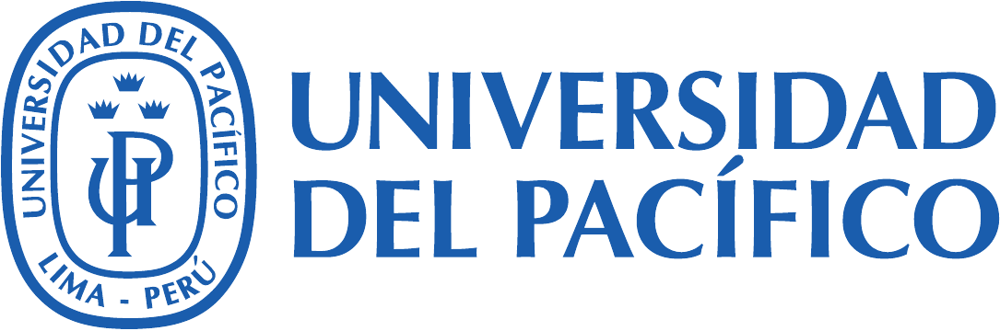

# Métodos Numéricos - 2026-2

<p align="center">
  
</p>

Repositorio docente del curso **Métodos Numéricos (130146-A)** de la
**Facultad de Economía de la Universidad del Pacífico**.

**Docente:** Oswaldo José Velásquez Castañón  
**Periodo académico:** 2026-2

## Material disponible

### Notas del curso

- [Métodos Numéricos - notas 2026-2](notas/Metodos_Numericos_2026-2.pdf)

Las notas reúnen el material central del curso. Esta edición fue recompilada el
20 de agosto de 2026 y se encuentra en revisión y modernización progresiva. El
capítulo 1 incorpora grafos computacionales como representación visual de la
composición de funciones elementales y de la propagación de errores de entrada
y redondeo. El capítulo 2 contiene la formulación revisada de convergencia para
sucesiones escalares y vectoriales, convergencia lineal, superlineal y
cuadrática, y criterios de parada.

### Presentaciones

- [Unidad 1: Fundamentos del análisis numérico](presentaciones/Unidad_1_Fundamentos_Analisis_Numerico.pdf)
- [Unidad 2: Métodos iterativos y velocidad de convergencia](presentaciones/Unidad_2_Metodos_Iterativos_Convergencia.pdf)
- [Unidad 3A: Sistemas lineales, sustitución, Gauss y Gauss--Jordan](presentaciones/Unidad_3A_Sistemas_Gauss.pdf)
- [Unidad 3B: Factorización LU, estructuras especiales y condicionamiento](presentaciones/Unidad_3B_LU_Estructuras_Condicionamiento.pdf)
- [Unidad 3C: Factorización QR mediante Householder y Givens](presentaciones/Unidad_3C_QR_Householder_Givens.pdf)
- [Unidad 3D: Métodos iterativos matriciales](presentaciones/Unidad_3D_Metodos_Iterativos_Lineales.pdf)

La presentación de la Unidad 1 desarrolla representación en punto flotante,
errores, análisis diferencial, condicionamiento, estabilidad y costo
computacional.

La presentación de la Unidad 2 desarrolla el capítulo introductorio sobre
métodos iterativos mediante las tres nociones específicas de velocidad de
convergencia utilizadas en el curso, sin recurrir a una definición general de
orden.

La presentación de la Unidad 3A introduce los sistemas lineales, los sistemas
diagonales y triangulares, las sustituciones hacia adelante y hacia atrás, la
eliminación de Gauss con pivoteo parcial, Gauss--Jordan, el costo computacional
y la verificación mediante el residuo. Su
[fuente LaTeX editable](presentaciones/fuentes/Unidad_3A_Sistemas_Gauss.tex)
se publica junto con el estilo y el logo necesarios para recompilarla.

La Unidad 3B desarrolla la factorización LU con pivoteo, Cholesky, sistemas
tridiagonales, normas, condicionamiento, perturbaciones y diagnóstico mediante
el residuo. Está disponible su
[fuente LaTeX editable](presentaciones/fuentes/Unidad_3B_LU_Estructuras_Condicionamiento.tex).

La Unidad 3C presenta la factorización QR completa y reducida, su aplicación a
sistemas y mínimos cuadrados, y los algoritmos de Householder y Givens con un
ejemplo común. Está disponible su
[fuente LaTeX editable](presentaciones/fuentes/Unidad_3C_QR_Householder_Givens.tex).

La Unidad 3D cierra el capítulo con iteraciones estacionarias, radio espectral,
Jacobi, Gauss--Seidel, relajación, SOR y criterios de convergencia y detención.
Está disponible su
[fuente LaTeX editable](presentaciones/fuentes/Unidad_3D_Metodos_Iterativos_Lineales.tex).

### Laboratorios

- [Laboratorio 1: punto flotante, error y estabilidad](laboratorios/Lab_Unidad_1_Punto_Flotante.ipynb)

El cuaderno está ejecutado y utiliza Python y NumPy. Incluye experimentos sobre
representación, truncamiento, redondeo, cancelación, propagación de errores y
comparación de algoritmos.

## Ejecución del laboratorio

Con Python 3.11 o posterior:

```bash
python -m venv .venv
source .venv/bin/activate
python -m pip install -r requirements.txt
jupyter lab
```

Luego abra `laboratorios/Lab_Unidad_1_Punto_Flotante.ipynb` y ejecute las
celdas en orden.

## Estado del material

Este repositorio contiene las versiones vigentes para el periodo 2026-2. Las
notas históricas, evaluaciones y archivos internos de preparación no forman
parte de esta publicación.
